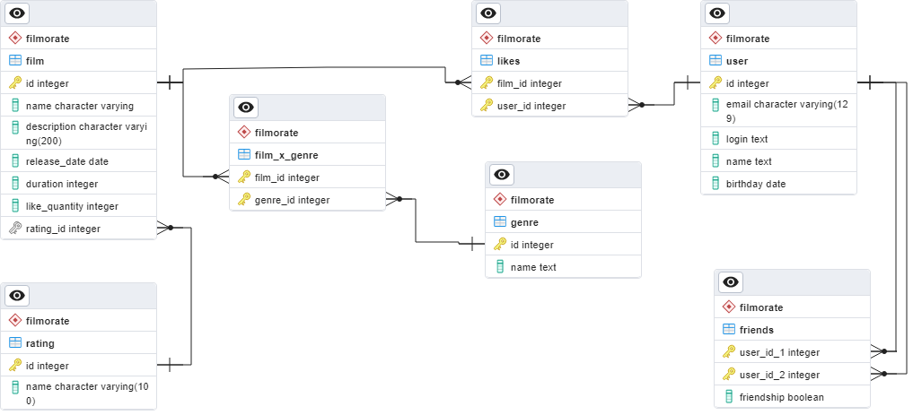

# java-filmorate

## Описание базы данных.
Данная база содержит несколько схем, по этому для обращение к таблицам происходит через название схемы.

### Запросы.

#### Все фильмы с описанием и рейтингом.
~~~sql
SELECT f.name, f.description, r.name
FROM filmorate.film AS f
JOIN filmorate.rating AS r ON r.id = f.rating_id
ORDER BY r.name DESC 
~~~

#### Все фильмы и их жанры.
~~~sql
SELECT f.name,g.name
FROM filmorate.film_x_genre fg
JOIN filmorate.film f on f.id = fg.film_id
JOIN filmorate.genre g on g.id = fg.genre_id
~~~

#### Получение количеста лайков у фильма.
~~~sql
SELECT f.name,count(l.user_id)
FROM filmorate.likes as l
JOIN filmorate.film as f on f.id = l.film_id
WHERE l.film_id = 1
GROUP BY f.name;
~~~

#### Состояние дружбы всех пользователей.
~~~sql
SELECT  u1.name, f.friendship, u2.name
FROM filmorate.friends as f
FULL JOIN filmorate.user as u1 on u1.id = f.user_id_1
LEFT JOIN filmorate.user as u2 on u2.id = f.user_id_2
~~~

#### Получение общих друзей.
~~~sql
SELECT user_id_2
FROM filmorate.friends
WHERE user_id_2 IN (SELECT user_id_2
FROM filmorate.friends as f
WHERE f.friendship = true and f.user_id_1 = 2)
and user_id_1 = 6 and friendship = true;
~~~
