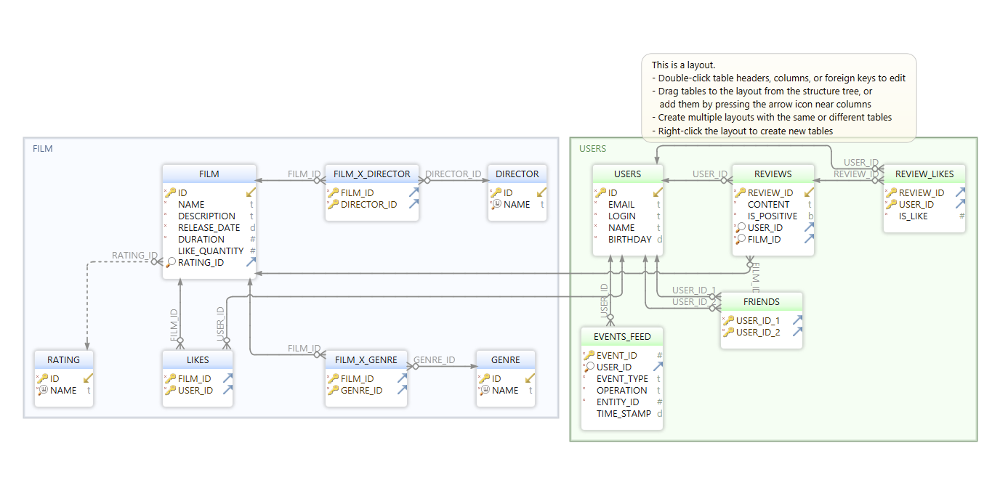

# java-filmorate

### Запросы.

#### Все фильмы с описанием и рейтингом.
~~~sql
SELECT
	 F.NAME, F.DESCRIPTION,R.NAME
FROM
	PUBLIC.FILM F
JOIN
    PUBLIC.RATING R ON R.ID = F.RATING_ID; 
~~~

#### Все фильмы и их жанры.
~~~sql
SELECT
    F.NAME FILM_NAME,
    G.NAME GENRE_NAME
FROM
	PUBLIC.FILM_X_GENRE FG
JOIN PUBLIC.FILM F ON F.ID = FG.FILM_ID
JOIN PUBLIC.GENRE G ON G.ID = FG.GENRE_ID;
~~~

#### Получение количеста лайков у фильмов.
~~~sql
SELECT 
    F.NAME,COUNT(L.USER_ID)
FROM 
    PUBLIC.LIKES L
JOIN PUBLIC.FILM F ON F.ID = L.FILM_ID
GROUP BY F.NAME;
~~~

#### Получение общих друзей.
~~~sql
(SELECT FR.USER_ID_2 FROM PUBLIC.FRIENDS FR WHERE FR.USER_ID_1 = 1)
INTERSECT
(SELECT FR.USER_ID_2 FROM  PUBLIC.FRIENDS FR WHERE FR.USER_ID_1 = 2);
~~~
